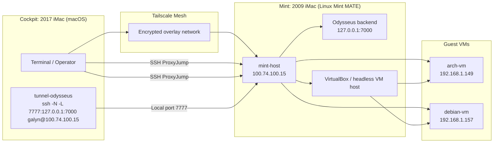

# Architecture Overview

This repository is the control plane and documentation source of truth for a dual-iMac homelab built around a macOS workstation, a Linux Mint virtualization host, and two managed guest VMs. The layout favors direct SSH access, repeatable Ansible automation, and terminal-native observability.

## System Overview

The environment is split into two primary physical systems:

| Role | Platform | Purpose |
| --- | --- | --- |
| **Cockpit** | 2017 iMac running macOS | Operator workstation, SSH client, tunnel origin, and day-to-day management surface |
| **Engine** | 2009 iMac running Linux Mint MATE | Hypervisor host, service runtime, and local routing anchor |

The Engine hosts the Linux virtualization layer and exposes managed guest systems:

| Guest | Address | Purpose |
| --- | --- | --- |
| **arch-vm** | `192.168.1.149` | Arch Linux guest for fast-moving or minimal service workloads |
| **debian-vm** | `192.168.1.157` | Debian guest for Debian-based workloads and package-compatibility testing |

The repository treats this topology as a layered control system:

1. **Cockpit** is where the operator works.
2. **Mint** is the network and compute hub.
3. **The VMs** are isolated workload targets accessed through Mint.
4. **Shell scripts and Ansible** keep the topology reproducible.

## Network & Routing

The network path is built around a Tailscale-backed control plane and SSH-based hop routing.

### Tailscale mesh

`mint-host` is defined in `ssh/config` with the Tailscale address `100.74.100.15`. That makes Mint the stable entry point for the Linux side of the lab, independent of local LAN changes.

The practical effect is:

- the macOS Cockpit can reach Mint over the encrypted Tailscale overlay,
- Mint can act as a stable jump point into the RFC1918 VM subnet,
- the lab remains reachable without exposing guest services directly.

### SSH ProxyJump mechanics

The SSH config uses `ProxyJump mint-host` for both `arch-vm` and `debian-vm`.

That means:

1. the SSH client opens a connection to `mint-host`,
2. Mint relays the SSH session to the target VM,
3. the VM is reached without a separate direct trust path from Cockpit.

This keeps the VMs off the outer edge of the network while preserving a simple operator command surface:

```bash
ssh arch-vm
ssh debian-vm
```

### Service tunnel: `tunnel-odysseus`

`shell/aliases.sh` defines a named tunnel:

```bash
ssh -N -L 7777:127.0.0.1:7000 galyn@100.74.100.15
```

This creates a local-only forward on Cockpit:

- local port `7777` on macOS maps to
- Mint’s loopback `127.0.0.1:7000`, where the Odysseus backend is expected to listen.

This is the cleanest route for exposing the backend without binding it publicly. The SSH session carries the traffic over the encrypted tunnel, and the application remains bound to loopback on the Mint host.

## Infrastructure Automation

The `ansible/` directory documents a multi-OS automation layout for inventory, routing, and package management.

### Inventory

`ansible/hosts.yaml` separates hosts into OS-oriented groups:

- `arch_nodes` → `arch-vm`
- `debian_nodes` → `debian-vm`

Each host declares:

- its reachable IP address,
- the shared SSH user (`galyn`),
- and enough information for group-targeted tasks.

### Update orchestration

`ansible/playbook.yml` is a distro-aware update routine:

- Arch systems use `community.general.pacman`
- Debian systems use `ansible.builtin.apt`

The playbook branches on `ansible_os_family`, so the same run can safely target both guest types while preserving native package tooling.

### SSH key injection

`ansible/ssh_injection.yaml` standardizes access by installing the operator public key for `galyn` across managed endpoints using `ansible.builtin.authorized_key`.

This is important because it keeps access consistent across the lab and reduces manual per-host setup.

### Configuration boundary

`ansible/ansible.cfg` is the repository’s Ansible runtime anchor. Even when its contents stay minimal, the file marks the playbooks and inventory as part of a controlled, repeatable automation workflow rather than ad hoc terminal state.

## Local Shell Control Surface

The `shell/` directory provides operational shortcuts for lifecycle management and observability.

### VM lifecycle aliases

`shell/aliases.sh` exposes:

- `start-lab` to start the Arch and Debian VMs headlessly,
- `stop-lab` to request graceful shutdown,
- `start-odysseus` to launch the Python backend on port `7000`,
- `tunnel-odysseus` to expose that backend to Cockpit through SSH.

### Session dashboards

The init scripts are terminal-native status surfaces:

- `shell/init/start_cockpit.sh` creates a tmux session for Cockpit-style system oversight.
- `shell/init/cybercockpit.sh` focuses on runtime observability with `journalctl`, `htop`, and `bmon`.
- `shell/init/debiancockpit.sh` emphasizes Docker operations with container, stats, and log panes.

### Shell bootstrap

`shell/bashrc_snippet.sh` wires the environment together by:

- presenting a branded terminal startup sequence,
- initializing `starship`,
- auto-launching tmux when appropriate,
- and sourcing the shared alias file.

## Local AI Runtime

`AI/Modelfile` defines a lightweight local model profile:

- base model: `llama3.2:1b`
- CPU threads: `2`

This suggests a constrained local inference setup intended for small, low-overhead tasks rather than high-throughput model serving.

## Repository Map

| Path | Responsibility |
| --- | --- |
| `README.md` | High-level project narrative and current lab summary |
| `docs/architecture.md` | Canonical architecture reference |
| `docs/linux-virtualization-security-socat.pdf` | Supporting research on virtualization and socket-based routing |
| `ansible/` | Inventory and configuration management |
| `ssh/` | SSH routing and jump-host definitions |
| `shell/` | Operator aliases, bootstrap hooks, and tmux dashboards |
| `AI/` | Local model configuration |

## Architecture Flow



## Operational Notes

- The lab is designed around encrypted, named access paths rather than direct host exposure.
- The Mint host is the primary routing and workload anchor; the VMs are downstream targets.
- The repository is most useful when treated as infrastructure-as-code plus operator ergonomics, not as a general-purpose application codebase.